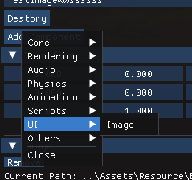

# ImageComponent 사용하기

---

### 컴포넌트 추가하기

모든 UI 컴포넌트는 Others에 있는 RectTransform을 추가해야합니다.

추가하지 않으면 UI 컴포넌트들은 동작하지 않습니다. ( Update문에서 무시함 )

Image 컴포넌트는 RectTransform을 기반으로 이동합니다.

Transform의 Position,Scale은 동작하지 않으며, **Rotation의 Z 값만 회전으로서 영향을 받습니다.**

Pos값으로 위치를 이동합니다. (px 단위)

Size값을 통해 이미지의 크기를 조절합니다 (px단위)

> 별도 인스펙터 처리를 안했기때문에 발생한 상황이므로 무시하시면됩니다.
> 

### public

| 함수명 | 내용 |
| --- | --- |
| GetTextureByPath | 문자열을 받아서 이미지 처리 |
| GetType | Filltype 반환 |
| SetType | Filltype 변경 |
| GetColor | Color 값 가져오기 |
| SetColor | Color 값 변경 |
| GetFillAmount | Fill Mode에 사용할 값 가져오기 |
| SetFillAmount | Fill Mode에 사용할 값 수정 |
| GetBorderPx | Sliced Mode 에 사용할 border 값 ( Left, right, top, bottom ) |
| SetBorderPx | Sliced Mode 에 사용할 border 값 설정 |
| GetPath | 현재 사용하는 리소스 패스 값 |
| SetPath | 패스 값 설정 ( RTTR 용으로 건들지 말 것) |
| ChangeData | 리소스 데이터 바꾸는 함수 ( 현재 사용하는 텍스처가 교체됨. ) |

### private

| 변수명 | 내용 |
| --- | --- |
| resource | 해당 Image 컴포넌트가 사용하는 데이터 (shared_ptr) |
| type | 이미지 타입 |
| color | base 색상 |
| fillAmount | fillmode 값 |
| sliceBorderPx | 9-Sliced 보더 값 (L, R, T, B) |
| path | 현재 사용하는 이미지 경로 |
| isMouseCheck | 마우스 hover 확인 boolean |

### enum

| Simple | 기본 이미지 출력 |
| --- | --- |
| Sliced | 9-sliced |
| Fill | 이미지 채우기 |